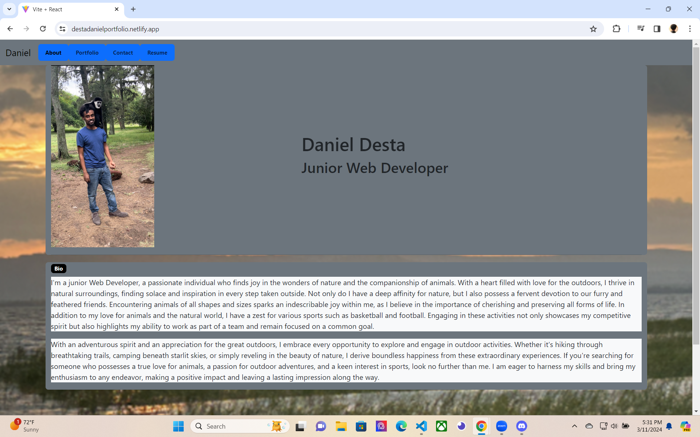

# React-Portfolio

  
    

  ## Description
  
  This app is about my React portfolio and the different pages I have in it like the about page, the portfolio page, contact page, and the resume page.
  Each page has it's own unique title and description of what is going on in it, everything about me and my accomplishments in this UCF Bootcamp.
  
  ## Table of Contents 
  
  
  
  - [Installation](#installation)
  - [Usage](#usage)
  - [Credits](#credits)
  - [License](#license)
  
  ## Installation
  
npm install all my dependencies  

## Screenshots

  ## Usage
  
  
This app is all about my React portfolio and everything about me and my accomplishments in this UCF bootcamp, using everything I learned so far to
create my very own personal app that shows my portfolio.
  
  ## License
  
A short and simple permissive license with conditions only requiring preservation of copyright and license notices. Licensed works, modifications, and larger works may be distributed under different terms and without source code.
  [https://choosealicense.com/licenses/mit/](https://choosealicense.com/licenses/mit/)

  
  ## How to Contribute
  Daniel Desta
  github.com/DDesta25
tekoladaniel@gmail.com
  
  
  ## Tests
  npm start
